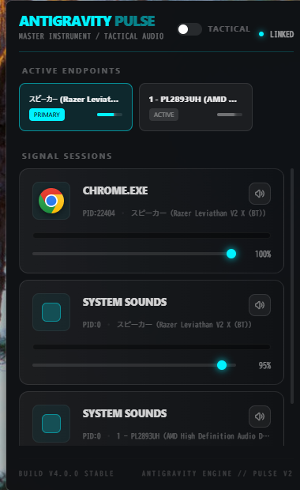

# 🌌 Antigravity Pulse

<p align="center">
  
</p>

**Antigravity Pulse** は、Windows 11 のために設計された、究極の視認性と操作性を備えた「戦術的」オーディオミキサーです。
Tauri v2 + React 19 + Rust (windows-rs) を駆使し、OS の非公開 ABI を直接制御することで、標準機能を凌駕する体験を提供します。

---

## ✨ 主な機能

### 1. High-Vis Elite UI (高密度計器盤)
*   **GPU 加速ピークメーター**: CSS アニメーションを一切使わず、Canvas API を経由して 60fps で滑らかに描画。CPU 負荷を極限まで抑えたネオンパルス。
*   **3段積みアプリカード**: 必要な情報を 380px の幅に凝縮。アイコン、PID、デバイス名、ボリューム、パルスを一目で把握。
*   **Mica / Acrylic サポート**: Windows 11 のネイティブ視覚効果に完全対応。

### 2. ABI Mastery & D&D ルーティング
*   **直感的な操作**: アプリカードをデバイスパネルへ **ドラッグ＆ドロップ** するだけで、即座に出力先を切り替え。
*   **確実な制御**: 非公開の VTable Index 25 を直接叩き、Windows 内部の 3 つのオーディオ役割（コンソール、メディア、通信）を一度に更新。

### 3. プロフェッショナルな実用性
*   **Process Shadowing**: プロセスハンドルを直接監視し、終了したアプリがミキサーに残る「ゴーストセッション」を完全に排除。
*   **グローバル召喚**: `Win + Alt + A` ホットキーで、マウスカーソルの位置に瞬時にミキサーを表示。
*   **タクティカル・モード**: チェックボックス一つで透過度を上げ、Always on Top（常に最前面）に固定。作業を邪魔せず音量を常時監視。
*   **自動起動**: Windows ログイン時のオートローンチ制御を完備。

---

## 🚀 クイックスタート

### 開発環境の要件
*   Node.js 22+ & npm
*   Rust (latest stable)
*   Windows 10 Build 1709+ (Mica などの高度な効果には Windows 11 推奨)

### ビルドと実行
```bash
# 依存関係のインストール
npm install

# 完全なビルド (フロントエンド + Rust)
npm run build
npx tauri build --no-bundle

# 実行
./src-tauri/target/release/antigravity-pulse.exe
```

---

## 🛠️ 技術スタック
- **Frontend**: React 19, TypeScript, Tailwind CSS v4, Vite
- **Backend**: Rust 2021, Tauri v2
- **Windows API**: `windows-rs` 0.58 (Audio Endpoint, Policy Config, GDI, WinReg)
- **Visuals**: `window-vibrancy`, HTML5 Canvas (GPU Accelerated)

---

## ⚖️ 免責事項
本プロジェクトは、Windows の非公開 API を使用しています。将来の OS アップデートにより挙動が変わる可能性がありますが、Antigravity Protocol に基づき、常に最新の ABI Mastery を維持することを目指します。

---
Created with 🎸 and AI precision.
